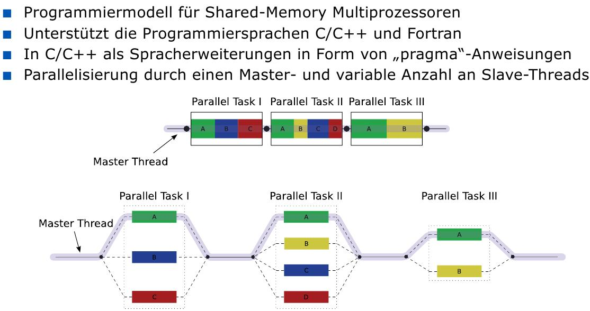
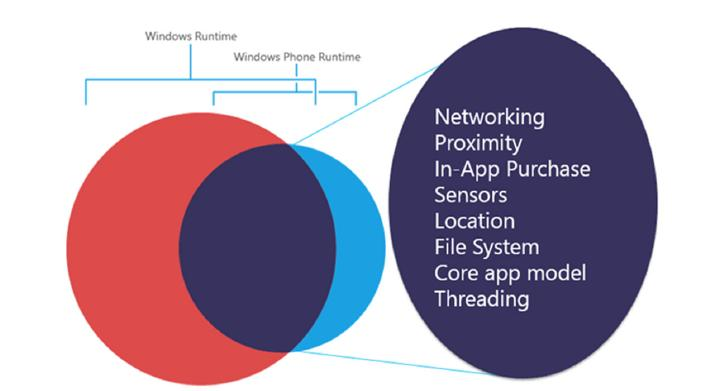
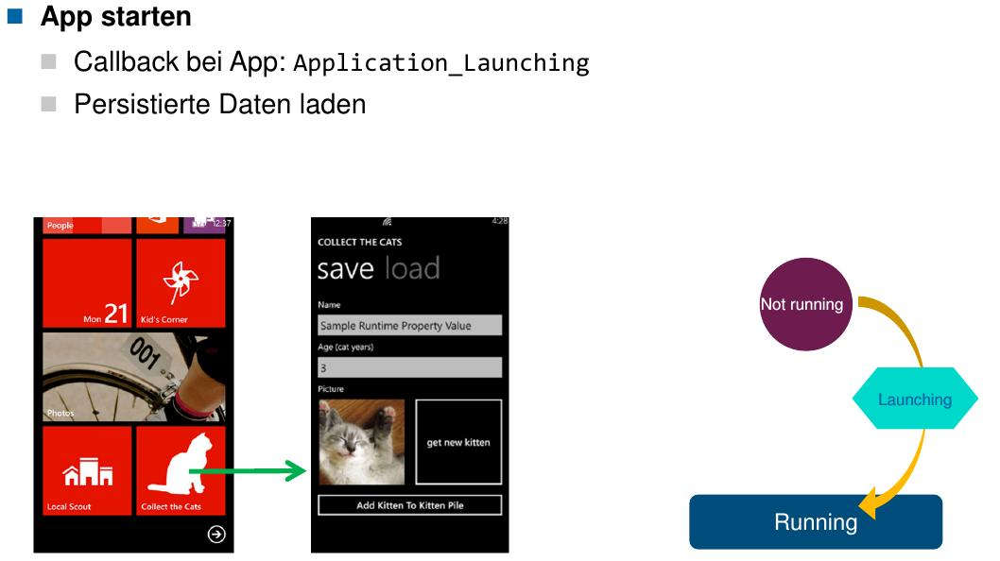

==================
FS14 Summary BsKon
==================

1 E/A
=====

* E/A Verwaltung: 
	* ist eine Teilfunktion des Betriebssystems
	* realisiert standardisierte E/A-Schnittstellen, Datenfluss zwischen Anwendungsprozess und Peripheriegerät, verwaltet SW-Komponenten für die Unterstützung verschiedener Peripherie, setzt logische Peripheriebezeichnungen (Namen) in interne Referenzen um, erkennt das Hinzufügen neuer und Entfernen bestehender Peripherie, ...
	

Mögliche E/A-Architektur (Prinzipbeispiel):

1.1 Ein-/Ausgabedatenbasis
--------------------------

* Inhalt
	* Informationen über aktuell vorhandene Peripheriegeräte
	* Liste der aktuell installierten Treiber
	* Ladeanweisungen für installierte Treiber
	* Sammlung (noch) nicht installierter Treiber (bzw. Referenzen auf zugehörige Dateien)
	* Installationsanweisungen
	* Zuordnungstabellen von Gerätetypen/-modellen zu Treibern
	* Zuordnungen von log. Kanalnummern bzw. Gerätenamen zu Geräteinstanzen
	* Zuordnungen von Treibern zu Geräteinstanzen
* Informationsquellen
	* Systeminstallation (detaillierte Hardwareerkennung)
	* Systemstart (summarische Hardwaredetektion)
	* Plug-And-Play (löst sog. Enumeration aus zur Erkennung geänderter Hardware)
	* Konfigurationswerkzeuge (komandozeilenbasiert oder GUI-gesteuert)
	* Anwendungsprogramme (prinzipiell möglich, eher unwahrscheinlich)

* logisch abstraktes Gerät: z.B. virtueller Speicher im Shared Memory

**Schwachstelle Pluginarchitektur / Schnittstellenarchitektur**
Software kann sicher sein, Plugin bringt wieder Lücken rein.

	
1.2 Hardwareschnittstelle
-------------------------

* Konversion angelieferter Daten in gerätespezifische Formate (und umgekehrt)
* Durchführung der Gerätesteuerung bzw. Hardwareansteuerung

.. image:: img/1.4.jpg

* Controller
	* Befehlsregisters: ermöglicht das auslesen von Zuständen des Geräts
	* Datenregister: Schreiben und lesen E-/A Daten ein- und aus

* Wo „findet“ die Software das Peripheriegerät?
	1. Register des Peripheriekontrollers sind im Hauptspeicher-Adressraum
	2. Register des Peripheriekontrollers sind in separatem E/A-Adressraum
	3. Spezialfall: Gerät ist an Peripheriebus angeschlossen (z.B. SCSI, USB):
		* Gerät gehört zu standardisierter Geräteklasse, z.B. SCSI-Geräte (Zusätzliche Abstraktions- bzw. Indirektionsstufe)
		* Funktionen dieser Geräteklasse (z.B. SCSI-Busbefehle) dienen zum Zugriff (d.h. kein direkter HW-Zugriff)
		* Treiber kommuniziert mit Buskontroller-Baustein (erteilt ihm Befehle bzw. fragt Daten über die angeschlossene Peripherie ab)

1.3 Treiber
-----------

* Dateisystemtreiber
	*  Realisieren ein bestimmtes Dateisystem
	* Nutzen spezielle Treiberschnittstelle zu Dateisystemteil des Betriebssystems
	* Sind logische Treiber, d.h keine Gerätetreiber (setzen auf Blocktreiber auf)
	* Voraussetzung: Vorhandensein eines Virtual File Systems
	* Abstraktion eines Dateisystems (mit zugehöriger Schnittstelle für Treiber)

1.4 Datenflüsse
---------------

* Daten
* Zustände (hat's geklappt? Wie viele Bytes, ...)

* Synchronität der E/A aus Anwendungssicht
	* Synchron: Anwendungsprozess wartet bis E/A komplett
	* Asynchron: Anwendungsprozess arbeitet weiter, holt Resultate später ab (wird evtl. benachrichtigt)
* Synchronität der E/A aus Betriebssystemsicht:
	* Synchron: Durchführung der E/A folgt direkt den E/A-Aufträgen des Anwendungsprozesses
		* Synchroner Prozess kann aus BS Sicht asynchron sein, wenn er z.B. vom Scheduler unterbrochen wird
	* Asynchron: Durchführung der E/A ist von Anwendungsprozess weitgehend entkoppelt

		::

			| user call           [ user process ]       ------.                        .-------> Zeit
			v                                                  v                        ^
			| system call         [    kernel    ]             '-------.       .--------'
			v                                                          v       ^
			| driver function     [   driver     ]                     '-------'
			v
			|                     [   Hardware   ]
			v
			
	
		* Asynchroner Aufruf läuft aus Treibersicht synchron!
		

* Szenario A: 
	* HW Zugriff kurz (in einem Schritt)
	* Läuft im Prozesskontext
	* Treiber läuft in gleicher Umgebung wie Prozess selbst
* Szenario B: 
	* Anwenderprozess wird schlafen gelegt (Prozessumschaltung)
	* Interrupt aktiviert die Interrupt-Servicerouting, die den Event handelt
	* Läuft in Prozessumgebung von Prozess 2 (Interrupt Kontext)
	* Treiber läuft in Unterbrechungskontext (Eingeschränkt) -> z.B. kein Datenaustausch mit der Anwendung
	* Daten von HW werden in einem Kernel zwischenspeicher gehalten, bis Prozess 1 wieder dran ist (in dem gezeigten Fall hat er eine höhere Priorität und läuft gleich weiter)
* Interrupts können zu Synchronisationsproblemen führen
* Aus Sicht des Anwenderprozess läuft der Zugriff synchron
* Aus Sicht des Systems läuft der Zugriff asynchron, da er unterbrochen und benachrichtigt wird

1.5 Treiber & Interrupt
-----------------------

* Treiber: Sammlung von Funktionen

* Nacharbeit von Interrupt läuft auf einer tieferen Prioritätsstufe -> Peripheriegerät mit höherer Priorität kann Bearbeitung unterbrechen

.. figure:: img/1.11.jpg

   Interrupt Serviceroutine wird so kurz wie möglich gehalten, indem nicht kritische Dinge in einen Nachbearbeitungsprozess verlagert wird. -> Keine ISR braucht mehr Zeit als unbedingt nötig -> Zeitkritische Zugriffe von andern Prozessen werden nicht verzögert.

1.6 Treiberinstanz
------------------

* Verbindung zw. Anwenderprozess und Treiber selbst

1.7 Portable Treiber
--------------------

* Treiber für Gerät X soll möglichst portabel sein
* Treiber ist korrekt lauffähig auf unterschiedlichen Rechnern, die aber einen gleichartigen Anschluss von X unterstützen (z.B. PCI-Bus)
* Portabilität kann/darf ein Neuübersetzen des Treiber-Quellcodes beinhalten
* Probleme: Unterschiedliche Compiler mit untersch. Datentypen und Ausrichtungsregeln im Speicher

1.7.1 Lösungen
..............

* Fallweise Semaphore oder Spinlocks einsetzen
* Spezielle Systemdatentypen fixer Grösse im Adressraum benutzen
* Kompakte Speicherung bei Übersetzung vorschreiben („packed“)

2 Linux Treiber
===============

   Methoden für Hardwarezugriff

* ioperm schaltet einen bestimmten Adressbereich frei
* iopl versetzt den Anwenderprozess in den privilegiestatus vom Kernel

   Kernel-Mode Treiber

.. note:: Spezialdatei beschreibt wie Device gebunden wird und stellt Schnittstelle zur Verfügung. Der Anwendungsprozess verwendet ganz gewöhnlich open, close, ... .

* Zeichenorientierte Gerätedateien sind mit c gekennzeichnet, blockdevices mit b
	* Bezieht sich auf die Schnittstelle zwischen Treiber und Gerät
		* Zeichenorientiert: Kleinste E/A Einheit ist Byte
		* Blockorientiert: Kleinste E/A EInheit ist Block von 2er Potenz von Byte (Treiberabhängig)
			* Blockorientierung spielt nur intern eine Rolle. Die Anwenderprozesse arbeiten ganz normal damit -> Schreibt der AWP ein Byte, so schreibt z.B. der SSD Treiber einen 4KB Block.
* Major Number identifiziert den Treiber
* udev: 
	* Userspace device.
	* Gerätemanager für Linux
	* Nur wirklich verwendete Treiber werden geladen.

	
2.1 Dynamische Treiber
----------------------

* Werden automatisch geladen, wenn neue Geräte detektiert werden.
* laden/entladen während Betrieb.

2.2 Interrupts
--------------

   Geräteinterrupts

* Shared Interrupt: Mehrere Geräten benutzen die gleiche Interruptleitung

* Anwenderprozess schläft, während HW die Daten zur Verfügung stellt und die ISR sowie die Nachbearbeitungsroutine ausgeführt wird. Erst nachher wird der Anwenderprozess wieder aufgeweckt.
* read() Aufruf dauert so lange, bis die Daten da sind

* interruptible: Prozess kann durch Signale unterbrochen werden

2.3 Blockgeräte
---------------

3 Windows Treiber
=================

* Peripherie ist eine virtuelle Datei

WDM Treibermodell
-----------------

.. image:: img/3.2.jpg

* Dateiobjekt verbindet Anwendungsebene mit Kernelaufruf
* Mehrere Geräte können auf das gleiche Treiberobjekt verweisen
* Auftragsobjekt (Input- Output Datenobjekt)

* Gerät besitzen symbolische und Anwendungsnamen
* Treiberinitialisierung mappt den symbolischen (internen) Namen mit dem Namen für die Anwendungssicht

.

* Bus Ennumeration: Alle Slots werden durchnummeriert beim Start, wenn eine Karte drin ist

.

* Root Bus Driver Kennt Hardware auf Plattine
	* Erkennt und initialisiert weitere Bustreiber wie PCI, USB oder SCSI
	* Erkennt eingebaute Peripherie (Main Board)
* PCI Bus teilt Interrup Nummern den einzelnen Slots zu (Keine Kollisionen)

WDF Treibermodell
-----------------

* Implementiert Standardreaktionen auf Ereignisse -> Treiber definiert nur abweichendes Verhalten
* Treiberkontext kann als frei verwendbarer Zusatzspeicher verwendet werden

Benutzermodustreiber
....................

* Reflector: Kernelmodetriber, der als Basis für Usermode Treiber dient.
* C++ für Benutzermodustreiber möglich (C-Makros)

Kernmodustreiber
................

* C++ nicht möglich
* Warteschlangen für IRPs
* Standardbehandlung für PnP Ereignisse
* WDF erweitert WDM

.

.. code-block:: c

	// Initialisierungsroutine, Name vordefiniert
	NTSTATUS DriverEntry (IN PDRIVER_OBJECT DriverObject, 
		IN PUNICODE_STRING RegistryPath) {
		
		WDF_DRIVER_CONFIG config; // Uninitialisiert
		NTSTATUS status;
		
		// Config Initialisierung, Routine Registrierung
		WDF_DRIVER_CONFIG_INIT(&config, helloEventtDriverDeviceAdd);
		status = WdfDriverCreate(DriverObject, 
			RegistryPath, WDF_NO_OBJECT_ATTRIBUTES, &config, WDF_NO_HANDLE);
		return status;
	}

.. code-block:: c
	
	// Geräteregistrierungsroutine
	typedef struct {		// Struktur des Gerätekontexts
		char * phello; 		// (treiberspezifisch selbst fest-
	} FDO_DATA, *PFDO_DATA;		// gelegte Datenstruktur)
	
	// Wird vom PnP aufgerufen, Funktionsname beliebig
	// Alle Variablen müssen am Anfang der Funktion deklariert werden 
	// da der Compiler der alten Schule ist
	NTSTATUS helloEventtDriverDeviceAdd(IN WDFDRIVER Driver,
		IN PWDFDEVICE_INIT DeviceInit) {
		
		WDF_OBJECT_ATTRIBUTES fdoAttributes;// Geräteobjekt-Konfiguration
		WDFDEVICE hdevice;		// Handle für Geräteobjekt
		UNICODE_STRING deviceName; 	// Gerätename (in Unicode)
		WDF_IO_QUEUE_CONFIG queueConfig;// Warteschlangen-Konfiguration
		WDFQUEUE hqueue;		// Handle für Auftragswarteschlange
		PFDO_DATA pMyContext; 		// Zeiger auf Gerätekontext
		
		// Privaten Speicher des selbst definierten Typs FDO_DATA zuweisen
		WDF_OBJECT_ATTRIBUTES_INIT(&fdoAttributes);
		WDF_OBJECT_ATTRIBUTES_SET_CONTEXT_TYPE(&fdoAttributes, FDO_DATA);
		
		// Für das Gerät einen Namen im globalen Namensraum eintragen
		RtlInitUnicodeString(&deviceName, L"\\DosDevices\\hello");
		WdfDeviceInitAssignName(DeviceInit, &deviceName);
		
		// Das Geräteobjekt anlegen
		WdfDeviceCreate(&DeviceInit, &fdoAttributes, &hdevice);
		// Einen Zeiger auf privaten Speicher FDO_DATA aufsetzen
		pMyContext = helloFdoGetData(hdevice);
		// Private Daten im Gerätekontext (=privater Speicher) ablegen
		pMyContext->phello = “Hello World!\n“;
		
		// Eine Auftragswarteschlange vorkonfigurieren
		WDF_IO_QUEUE_CONFIG_INIT_DEFAULT_QUEUE(&queueConfig,
			WdfIoQueueDispatchSequential);
		
		// Leseroutine bei Auftragswarteschlange registrieren
		queueConfig.EvtIoRead = helloEventIoRead;
		
		// Auftragswarteschlange nun erzeugen
		WdfIoQueueCreate(hdevice, &queueConfig, 
			WDF_NO_OBJECT_ATTRIBUTES, &hqueue);
			
		return STATUS_SUCCESS;
	}

	
.. code-block:: c

	VOID helloEventIoRead(IN WDFQUEUE Queue, IN WDFREQUEST Request,
		IN size_t Length) {
		
		WDFMEMORY memory;		// Adresse Lesepuffer
		PFDO_DATA pMyContext;		// Zeiger auf Gerätekontext
		WDFDEVICE hdevice;		// Handle des Geräts
		NTSTATUS status=STATUS_SUCCESS;
		
		// Frage die Adresse des Lesepuffers ab
		WdfRequestRetrieveOutputMemory(Request, &memory);
		// Setze Zeiger zu Gerätekontext auf, der zu lesenden Spruch enthält
		hdevice = WdfIoQueueGetDevice(Queue);
		pMyContext = helloFdoGetData(hdevice);
		// Bestimme effektiv zu lesende Anzahl Zeichen
		if (strlen(pMyContext->phello) < Length) {
			Length = strlen(pMyContext->phello)+1;
		}
		
		// Text aus Kontextspeicher umkopieren in Lesepuffer
		WdfMemoryCopyFromBuffer(memory, 0, pMyContext->phello, Length);
		// Komplettiere Auftrag mit Status und tatsächlich gelesener Anzahl
		WdfRequestCompleteWithInformation(Request, status, Length);
	}

Datenaustausch mit Applikation
------------------------------

* Problem: Deman Paging und Prozesswechsel führen dazu, das das Zielspeicherbereich bei der ISR gar nicht vorhanden ist.
* Lösungen
	* Buffered I/O
	* Direct I/O
	* Neither I/O

* Bestimmte RAM Pages werden nicht ausgelagert -> ermöglicht, das MDL für Treiber sichbar bleiben und permanent verfügbar sind

* Aufruf läuft nur dann, wenn der Treiber selbst auch läuft -> Kein Problem das Puffer nicht präsent ist -> für eingeschränkte Szenarien ohne Interrupt

4 Betriebssystemarchitekturen
=============================

Erweiterbare Systeme
--------------------

* BS Funktionalität kann durch App überschrieben werden, wenn BS Funktionalität nicht passt
* Applikationen müssen selbst Resourcen verwalten

.

   Erweiterungen in typengeprüfter Sprache

Typensichere Sprachlaufzeitsysteme
----------------------------------

.. note:: Eine Art Virtualisierung mit Schutzdomänen, Rechtesysteme, Trusted/Untrusted Code

.. image:: img/4.9.jpg

* Sicherheit auf CPU Level
	* Type Assembly Language TAL
		* CPU kennt Datentypen, Zeiger lassen sich z.B. nicht mit zahlen verrechnen
	* Certified Code PPC
		.. image:: img/4.12.jpg
		   :width: 50 %
		   
	* Selbstmodifizierender Code nicht erlaubt
	* Effizienter als z.B. JVM oder CLR Bytecode Verifier (5* weniger Code)

   Vor- und Nachteile von Typensicheren SLS

   Anforderungen an sicheren Code

Systemobjekte
-------------

* Konzeptionelle Objektorientierung
* Eindeutige Bezeichnung globaler Objekte / Namesräume
* Einheitliche Erzeugung und Freigabe
* Zentrale Zugriffsoperationen
* Operationsmitverfolgung: Tracing, Limiterung, Verrechnung (billing, charging)

.

.. image:: img/4.15.jpg
   :width: 70 %
   :align: left

* Sobald Referenz- und Handlezähler auf 0 fallen wird das Objekt abgeräumt

Unix System V
-------------

Sun Solaris (Linx vermutlich ähnlich)
-------------------------------------

Windows 7/8
-----------

.. image:: img/4.19.jpg

MSR Singualarity
----------------

* Software Isolierte Prozesse: 
	* Normalerweise sind Prozesse durch Hardware isoliert
	* -> Alternative wäre SIP: 
		* Sicherstellung, das der Code keine andern Applikationen beschädigt
		* kein (nach)laden von nicht typensicherem Code
		* kein Nachladen von nicht geprüftem Code
		* Overhead Verringerung
* Treiber sind ein Sicherheitskritisches Element, da sie mit Rechten des Kernels laufen

.

.. image:: img/4.22.jpg
   :width: 80 %
   :align: left

*  SIPs sind geschlossene Objekträume (closed object spaces), d.h. zwei Prozesse können nicht gleichzeitig ein Objekt nutzen
* SIPs sind geschlossene Coderäume (closed code spaces), d.h. ein Prozess kann nicht dynamisch Code nachladen oder erzeugen (nur Compile Time Reflection)
* Speicherbereitstellung nur in Mehrfachen von Seiten (Keine Garbage Collection nötig, einfaches Aufräumen bei Prozessende nötig)
* SIPs lassen sich feiner granular einsetzen, z.B. für Plug-Ins, Treiber, Systemerweiterungen

Vorteile
........

* Können schnell erzeugt werden
* Schnelle effiziente Kommunikation
* Jeder Prozess hat seine eigene Laufzeitumgebung

Singularity Kernel
..................

Realisiert als Microkernel als vertrauenswürdiger Code (trusted base):
* Restliche Teile des Systems sind in SIPs ausgelagert (als verifizierbarer Code)
* Die Systemintegrität basiert auf der Sicherheit der Programmiersprache
* Gegenwärtig: Compiler verifiziert Quell- und Zwischencode (intermediate code)
* Zukunft: Einsatz von TAL mit Verifizierung des Maschinencodes (compiled code)

Manifest
........

* Code
* Resoucen (Alle Resourcen, die benötigt werden um korrekt aufzuräumen)
* Applikationen können sich bei Dateien als Berechtigt eintragen -> andere Applikationen können auf diese Daten nicht zugreifen

Performance
...........

Architektur
...........

   Tippfehler: c# ist sicher und c++ unsicher

Review Systemarchitekturen
--------------------------

* Anforderungen an BS sind riesig und wiedersprechen sich teilweise
* Innovation was Kern angeht = 0, kaum Einsatz von neuen Konzepten
* Immer mehr erweiterbare, modulisierbare Konzepte
* Typisierte Assemblersprachen würden viele Vorteile bringen
* Code Reviews führen dazu, alte Konzepte widerzubenutzen

5 Multiprozessor- und Verteilte Betriebsysteme
==============================================

Typen von verteilten BS
-----------------------

   Master wird zum Flaschenhals, da er nur das BS ausführt
   
.. figure:: img/5.5.jpg

   Flaschenhals in Synchronisation der Daten

Message-Passing Multicomputer
.............................

* Cluster-Computer, Cluster-Workstation oder Tightly-coupled Processors
* Gitter, Torus, Netz, ... Verbindung
* Homeogene / Inhomogene Multiprozessor (CPU vom gleichen Typ oder nicht)
* Low-Level, RPC, Distributed Shared Meory oder ähnliches Messaging

Verteilte Systeme
.................

* Jeder Rechner ist ein vollwertiger Computer
* Cluster-Systeme, Middleware, ...

GPGPU
.....

* Hochleistungsrechner über die Grafikkarte realisiert
* HPC
* Spezielle Algorithmen, z.B. Map Reduce
* Flaschenhals: Datentransfer CPU/GPU

Hochleistungsrechner
....................

* HPC (High Performance Computing):
	* Grosse Rechenleistungen werden während kurzer Zeit benötig 
	* Gebaut für parallele und miteinander kommunizierende Rechenabläufe (tigthly-coupled parallel jobs)
* HTC (High Throughput Computing):
	* Grosse Rechenleistungen werden über längere Zeit hinweg benötigt (bis zu Monaten, Jahren)
	* Gebaut für sequenzielle voneinander unabhängige Rechenabläufe (independent sequential jobs)

* Verteilte Betriebssysteme
	* Single System Solution
	* Cluster Systeme mit Ortstransparenz
		* Benutzer sieht nur ein einziges System
		* Betriebssystem realisiert systeminterne rechnerübergreifende Kommunikation
		* Betriebssystem unterstützt einen Lastausgleich (load balancing)
* Cluster Systeme
	* kaum oder wenig Ortstransparent
	* Lastausgleich und Ausfallredundanz

.. note:: Ein verteiltes BS ist immer ein CLuster System, umgekehrt jedoch nicht unbedingt, wenn Ortstransparenz fehlt.

Parallel Programmiermodelle
---------------------------

* Gemeinsamer Speicher
* Messaging

DSM
...

* Scheinbar gmeinsames Memory aber verteilt
* Lokal
	* Paging basiert (Seite ist lokal oder entfernt)
		* Seitenzugriffsfehler lagert Seite von fremdem Rechner ein
		* Nur lesbar: einfach
		* schreibbar: kompliziert, Konsistenzprobleme
		
		.
		
		.. image:: img/5.7.jpg
		
	* Objekt basiert (Bereiche, Regionen variabler Grösse)
* Nicht sehr effizient

MPI
...

* Message Passing Interface
* Nachrichtenaustausch zwischen Rechnern

.. image:: img/5.8.jpg

::
	
	Vorher: 19 Zyklen, nachher 3 Zyklen	
	Reduktion: (19-3) / 19 = 68%

PVM
...

* Parallel Virtual Machine
	* Deamon: Message Router, Controller
	* Library: Konfig, Nachrichtenaustausch, Synchronisation
* Daten werden verpackt und an den Empfänger übermittelt, Empfänger wartet auf Daten von Sender mit bestimmtem Tag, entpackt Daten

* Läuft gut in heterogenen Umgebung zum Aufteilen einer Rechenaufgabe auf mehrere Rechner

OpenMP
......

FOS Factored Operating System
-----------------------------

* Bereitstellung nach Maximalbedarf ist eigentlich unattraktiv und ökonomisch nicht sinnvoll
* Fehlertoleranz muss hoch sein
* Verteilte Systeme sind notorisch unzuverlässig
* Synchronisationbedarf durch Synchonisierung

Prinzipien
..........

* Raum- statt Zeitmultiplex
	* Ev. Mehr CPU's als Prozesse
	* Geschickte Aufteilung auf mehrere Prozesse (Verteilte Working Sets)
* BS wird aufgeteilt in Funktionsspezifische Dienste
	* Laufen vollparallel auf verteilten Rechenkernen
	* Einzelne Dienste sind CPU's fest zugeteilt
	* Messagepathing für Dienstkommunikation
* Anpassung der Resourcen an Bedarf -> fortlaufende Überwachung

Implementierung
...............

* Fos erscheint dem Benutzer wie ein Single System Image
* Lauffähiger Prototyp
* Einheitliche Sicht der Resourcen
* Realisiert als Xen paravirtualisiertes BS, erlaubt Nutzung von Cloud Plattformen

Architektur
...........

* Mikrokern mit Instanz auf jedem Kern
	* Messaging
	* Zeitmultiplex pro Core
	
.
	

6 Rechenleistung von Multiprozessorsystemen
===========================================

   Flynn’sches Klassifikationsschema

   Single Instruction Multiple Data SIMD

.. figure:: img/6.3.jpg
   :width: 75 %

   Multiple Instruction Multiple Data MIMD

   Ideale Verhältnisse

   Reale Verhältnisse

   Vereinfachter Berechnungsansatz: Zusammensetzung aus Serieller und Paralleler Abarbeitung
   
   
Amdahl’s Law
------------

   Amdahl’s Law

   
::

	N: Parallelisierungsgrad
	Tm: Zeit total (ser+par)
	A: Arbeit
	Lsisd: Höhe (Leistung)
	Lmimd: Mittlere Leistung
	s: serieller Anteil
	p: parallelisierbarer Anteil
	
	Ts = s*A / Lsisd

	Tp = p*A / (n*Lsisd)
	
	Tm = Ts+Tp = A/Lsisd * (s+P/n) = A / Lmimd
	
	Lmimd = Lsisd / (s+p/n)
	Lmimd = x*Lsisd
	
	x = Lmimd / Lsisd = 1/ (s+p/n)
	s = 0: x = 1/(0+1/n) = n
	s = 1: x = 1/(1+1/n) = 
	
	

   Beispiel, zu 60% Parallelisierbar
   
   
.. warning:: Amdahl's Law kommt eine Aufgabe an Prüfung

Erweitertes Amdahlsches Gesetz
..............................

7 Android
=========

8 Windows Phone
================

* Quirks Code: Kompatibilitätslayer, damit WP 7 Apps unter WP 8 laufen.
	* verhalten kann unterschiedlich sein
* Keine Rückwärtskompatibilität (WP 8 Apps laufen nicht auf WP 7)
* WP Apps laufen nicht auf dem Desktop, Code ist aber zu 50% kompatibel. Nur das UI muss angepasst werden.
	* MVVM vereinfacht Portierung

.

   Kompatibilität WP 7/8
   

   Kompatibilität WP/Desktop

Startseite
----------

* Apps können als Tiles auf den Homescreen verlinkt werden
* Auch Subseiten von Apps lassen sich verlinken

Architektur
-----------

   Architektur

* WP8: Speicher pro App fix -> Speicherverschwendung, viel Auslagerung
* WP8.1: Speicher pro App wird zur Laufzeit festgelegt

Manifest
--------

* Capabilities der App
* Tiles
* Generelle Eigenschaften

Livecycle
---------

* Apps als ganzes besitzen einen Livecylce, nicht einzelne Seiteneffekte
* Applikation kann durch System deaktiviert werden wenn sie nicht im Vordergrund ist -> Kann ausgelagert werden (tombstoned)
* Bis WP8: neustart einer App wenn wieder aufgerufen wird, ab WP8: Fast resume

.

.. figure:: img/8.4.jpg
   :width: 80 %

   
   Im Hintergrund aber im Memory, UI Eingaben, State, Navigationstate bleibt erhalten.
   

   
   App wird entsorgt, State wird gespeichert

   
   Wenn App aus Tombstoned aktiviert wird: UI Daten Aus State müssen neu gesetzt werden
   

   
   OnNavigateTo(): Wenn Seite dargestellt wird, OnNavigateFrom(): Wenn Seite verlassen wird

* State Directory: Key-value Store indem States gespeichert werden können
* Sowohl Page wie App besitzen State Directory
* Benutzereingaben müssen manuell im State gesichert werden

Navigation
----------

* Navigationsziel wird als URI angegeben
* URI Mapper mappt URI's mit XAML Dateien

Persistenz
----------

* WP Apps sind isoliert. Der Isolated Storage einer andern App ist nicht zugreifbar.

.

   Installation Folger & Isolated Storage

* IsolateStorageSettings.ApplicationSettings: Key/Value Storage

.

.. figure:: img/8.12.jpg

   Ganze Files ablegen

   
Launcher & Chooser
------------------

* Launcher: Fire-and-forget Event zum Starten von Systemdiensten
* Chooser: Ein Task, um Informationen des Phone auszuwählen, z.B. eine Email-Adresse, mit der Kamera ein Bild erstellen, ...

Asynchrone Ausführung
---------------------

* UI Thread darf nicht blockiert werden
* Methode mit async kennzeichnen un mit await asynchron ausführen

   AsyncTask / Workerthread

